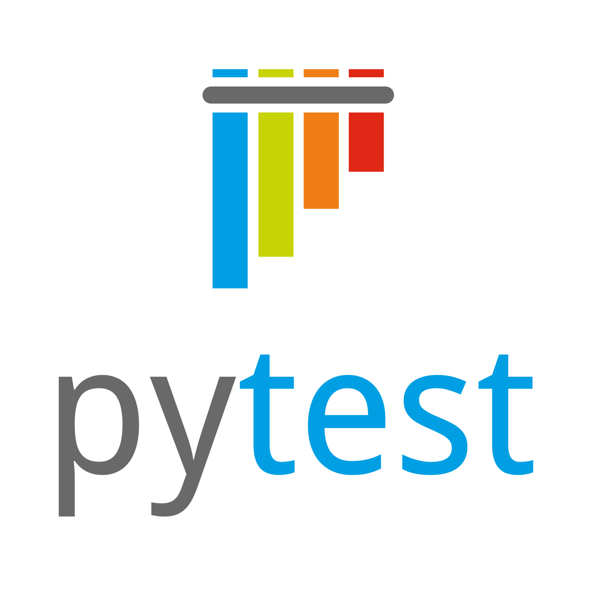

### Hi! 👋 I'm Ivan, Python QA Automation Engineer

### Welcome to my repositories!

### *My hard skills:*

### *Summary:*

### *Stats:*

### *Contacts:*

<table width="100%" border="0">
  <tr> 
    <td width="30%" valign="bottom"></td>
    <td valign="middle"><a href="inbox@ponomarev-iv.ru">inbox@ponomarev-iv.ru</a></td>
  </tr>
  <tr>
    <td width="30%" valign="bottom"></td>
    <td valign="middle"><a href="https://t.me/IV_Ponomarev">@IV_Ponomarev</a></td>
  </tr>
</table>

<!--
**ponomarev-iv1986/ponomarev-iv1986** is a ✨ _special_ ✨ repository because its `README.md` (this file) appears on your GitHub profile.

Here are some ideas to get you started:

- 🔭 I’m currently working on ...
- 🌱 I’m currently learning ...
- 👯 I’m looking to collaborate on ...
- 🤔 I’m looking for help with ...
- 💬 Ask me about ...
- 📫 How to reach me: ...
- 😄 Pronouns: ...
- ⚡ Fun fact: ...
-->
